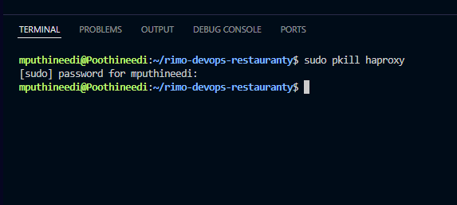
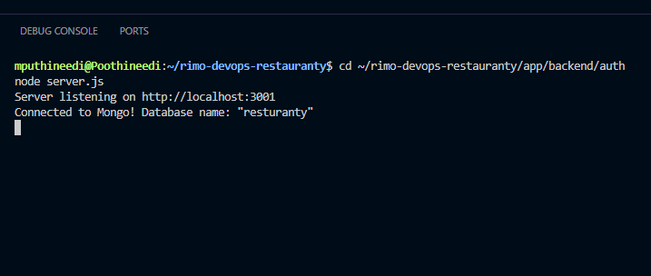
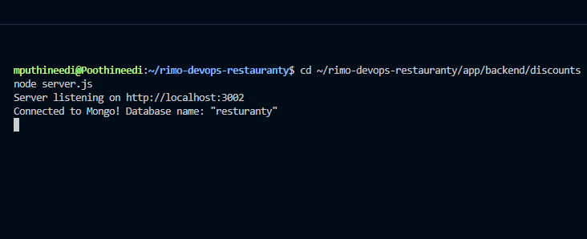
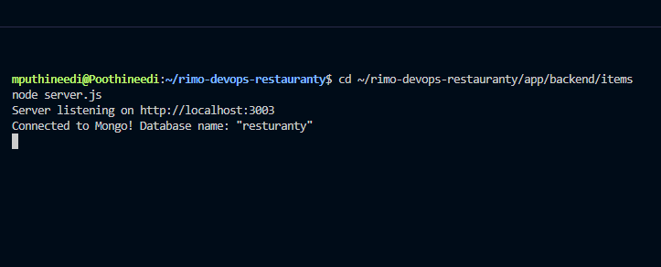
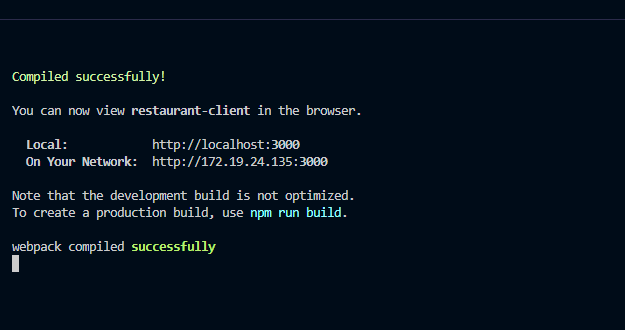
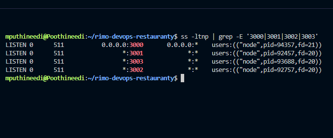
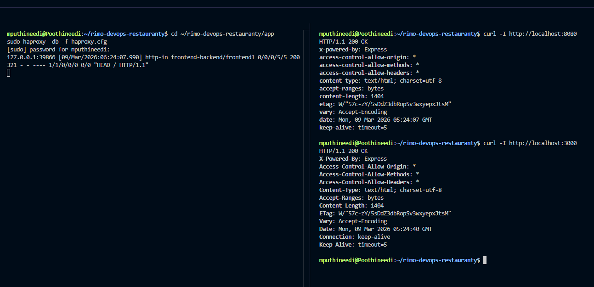

# HAProxy Local Routing Setup

After starting all microservices and the React frontend, HAProxy is used as a **reverse proxy** to expose the entire application through a **single entry point**.

This simulates how production environments route traffic to multiple services.

---

## 1. Stop Any Existing HAProxy Instance

First, ensure no previous HAProxy process is running.

```bash
sudo pkill haproxy
```

This guarantees the port is free before starting a fresh instance.



---

## 2. Start Backend Microservices

Start the **auth service**.

```bash
cd app/backend/auth
node server.js
```

Auth service runs on **port 3001**.



---

Start the **discounts service**.

```bash
cd app/backend/discounts
node server.js
```

Discounts service runs on **port 3002**.



---

Start the **items service**.

```bash
cd app/backend/items
node server.js
```

Items service runs on **port 3003**.



---

## 3. Start React Frontend

Run the frontend client.

```bash
cd app/client
npm start
```

Frontend becomes available at:

```bash
http://localhost:3000
```



---

## 4. Verify Services Are Listening

Confirm that all services are listening on the expected ports.

```bash
ss -ltnp | grep -E '3000|3001|3002|3003'
```

Expected ports:

- 3000 → React frontend
- 3001 → Auth service
- 3002 → Discounts service
- 3003 → Items service



---

## 5. Start HAProxy

Start HAProxy using the provided configuration.

```bash
cd app
sudo haproxy -db -f haproxy.cfg
```

This loads the routing configuration and begins listening on **port 8080**.

---

## 6. Test Unified Routing

Test that the application is accessible through HAProxy.

```bash
curl -I http://localhost:8080
```

Successful response indicates that HAProxy is routing traffic to the frontend correctly.



---
