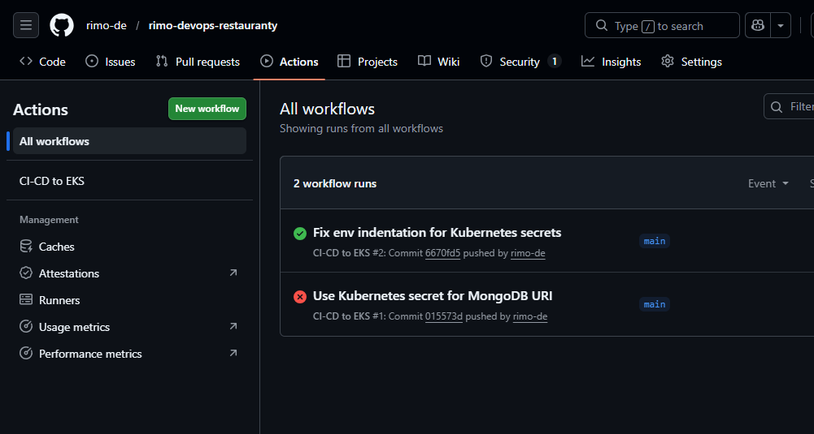

# CI/CD Pipeline

This document explains how the Restauranty application is automatically built and deployed using **GitHub Actions**.

The CI/CD pipeline performs the following tasks:

- Builds Docker images for all services
- Pushes images to Docker Hub
- Connects to AWS EKS
- Applies Kubernetes manifests
- Updates deployments with the latest image tags
- Verifies rollout status

---

## 1. Prepare GitHub Actions Workflow

A GitHub Actions workflow file was created in:

```bash
.github/workflows/ci-cd.yml
```

## 2. Required GitHub Secrets

Before running the pipeline, the following repository secrets must be configured in:

```bash
GitHub Repository → Settings → Secrets and variables → Actions
```

Required secrets:

- DOCKERHUB_USERNAME
- DOCKERHUB_TOKEN
- AWS_ACCESS_KEY_ID
- AWS_SECRET_ACCESS_KEY
- MONGODB_URI

These secrets provide secure access to Docker Hub, AWS EKS and MongoDB Atlas

## 3. Trigger the CI/CD Pipeline

Once the workflow file is committed, the pipeline is triggered automatically by pushing code to the main branch.

```bash
git add .
git commit -m "Add or update CI/CD pipeline"
git push origin main
```


