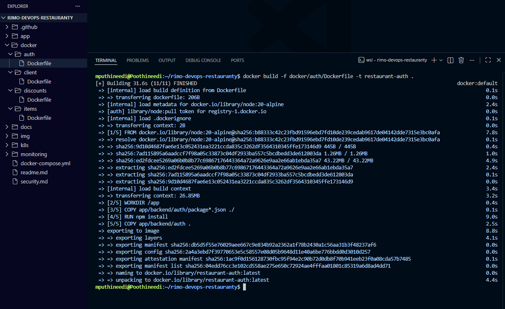
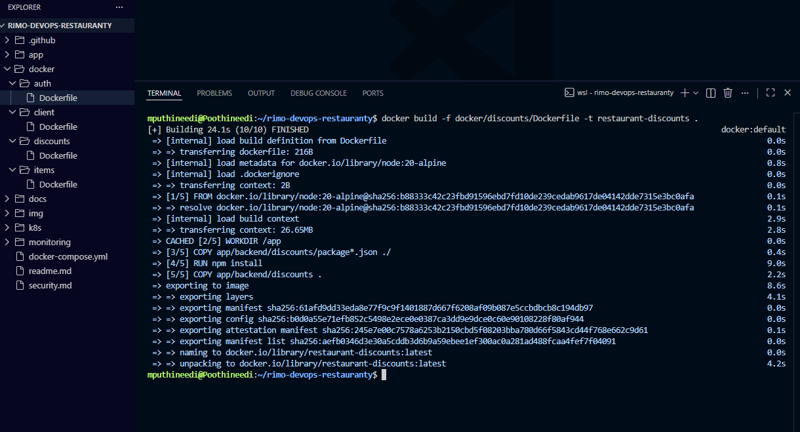
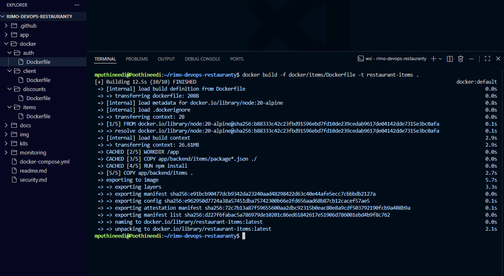
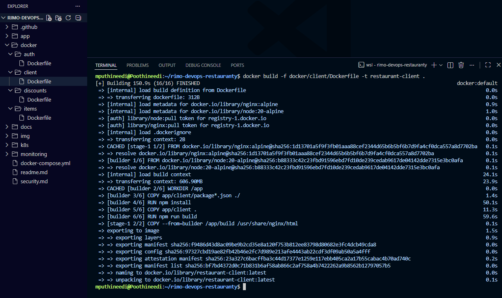
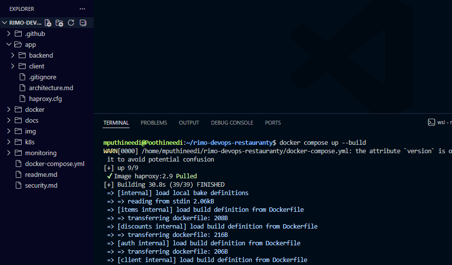
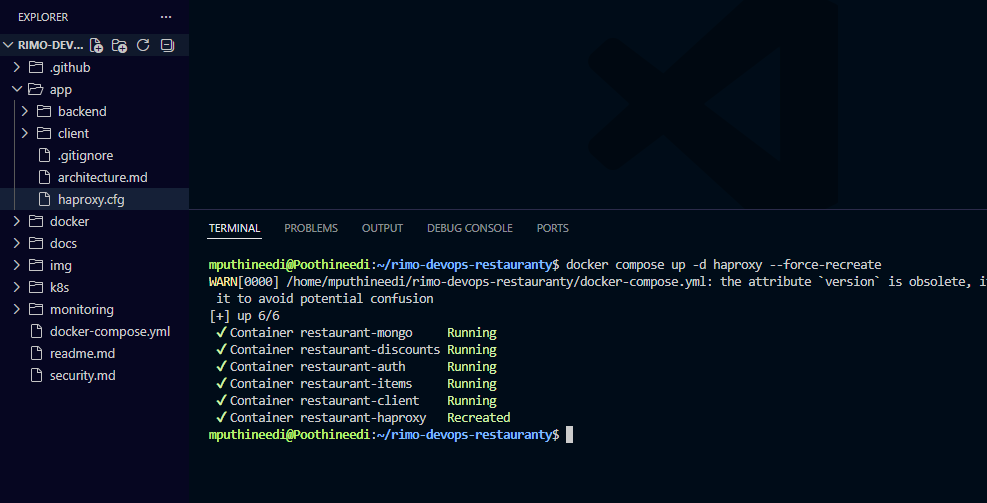
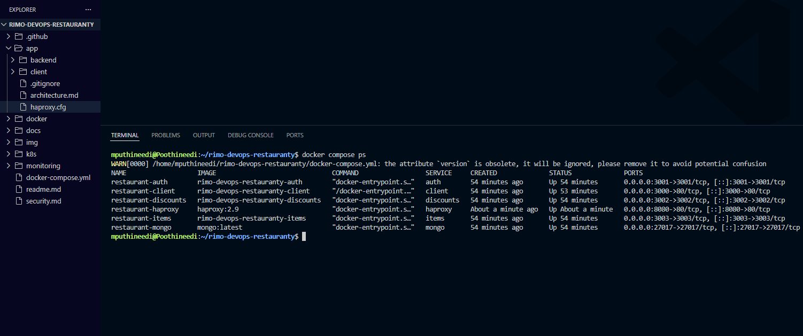
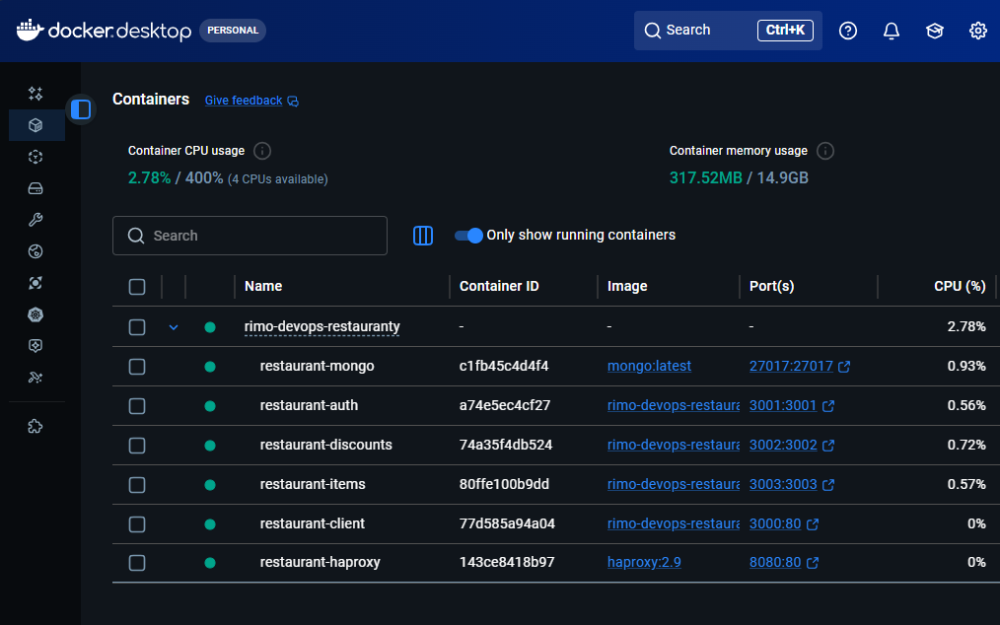
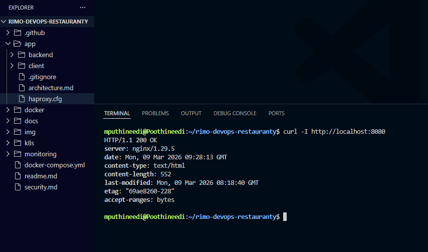

# Docker Setup

This document explains how the Restauranty application was containerized using Docker and orchestrated using Docker Compose.

The stack includes:

- MongoDB
- Auth service
- Discounts service
- Items service
- React client
- HAProxy

---

## 1. Build Backend Service Images

Separate Dockerfiles were created for the three backend microservices:

- `docker/auth/Dockerfile`
- `docker/discounts/Dockerfile`
- `docker/items/Dockerfile`

Each image installs Node.js dependencies and starts the service with `node server.js`.

### Build auth image

```bash
docker build -f docker/auth/Dockerfile -t restaurant-auth
```



### Build discounts image

```bash
docker build -f docker/discounts/Dockerfile -t restaurant-discounts .
```



### Build items image

```bash
docker build -f docker/items/Dockerfile -t restaurant-items .
```



---

## 2. Build Frontend Image

The React frontend uses a multi-stage Docker build:

- Stage 1: build the React application using Node.js
- Stage 2: serve the generated static files using Nginx

```bash
docker build -f docker/client/Dockerfile -t restaurant-client .
```



---

## 3. Run the Stack with Docker Compose

A docker-compose.yml file was created to orchestrate all services together.

It starts:

- MongoDB
- Auth service
- Discounts service
- Items service
- Client
- HAProxy

```bash
docker compose up --build
```



---

## 4. Recreate HAProxy After Config Fix

During setup, the HAProxy container initially failed because the mounted haproxy.cfg file had a formatting issue. After fixing the configuration file, HAProxy was recreated.

```bash
docker compose up -d haproxy --force-recreate
```



---

## 5. Verify Running Containers

Once the stack was started successfully, all containers were running as expected.

````bash
docker compose ps
```



Docker Desktop also confirmed that all services were healthy and running.



---

## 6. Test the Application

The application was tested through the HAProxy entry point.

```bash
curl -I http://localhost:8080
```



This confirms that HAProxy is routing requests correctly to the frontend and backend services inside the Docker network.

````
