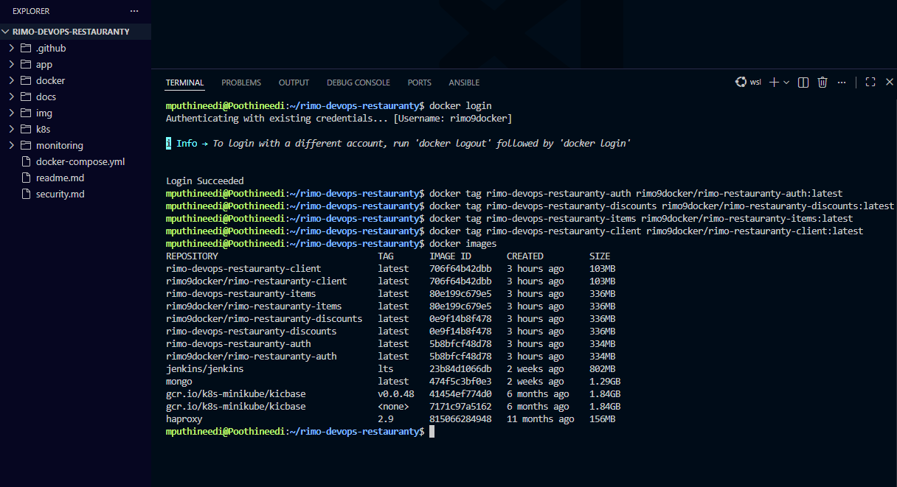
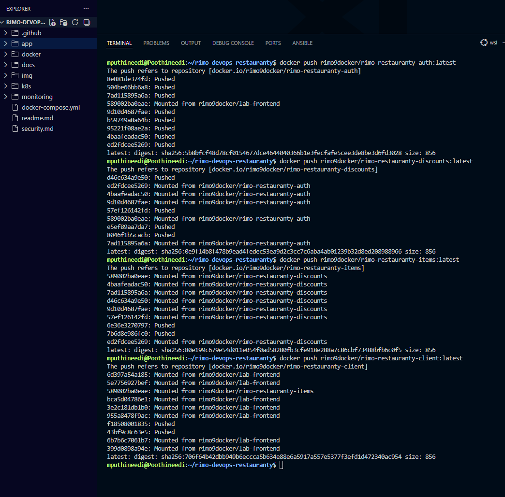
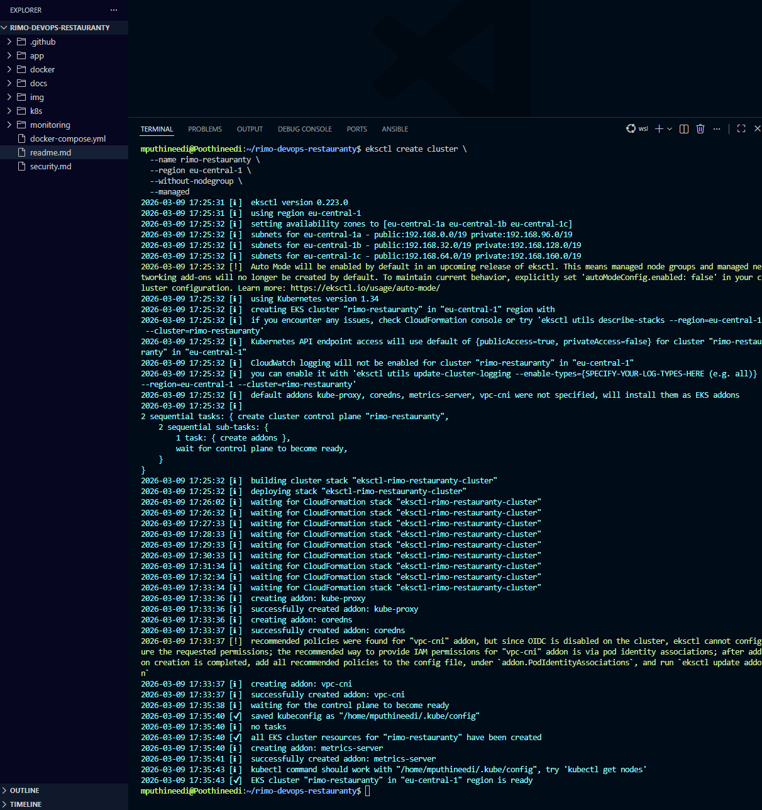
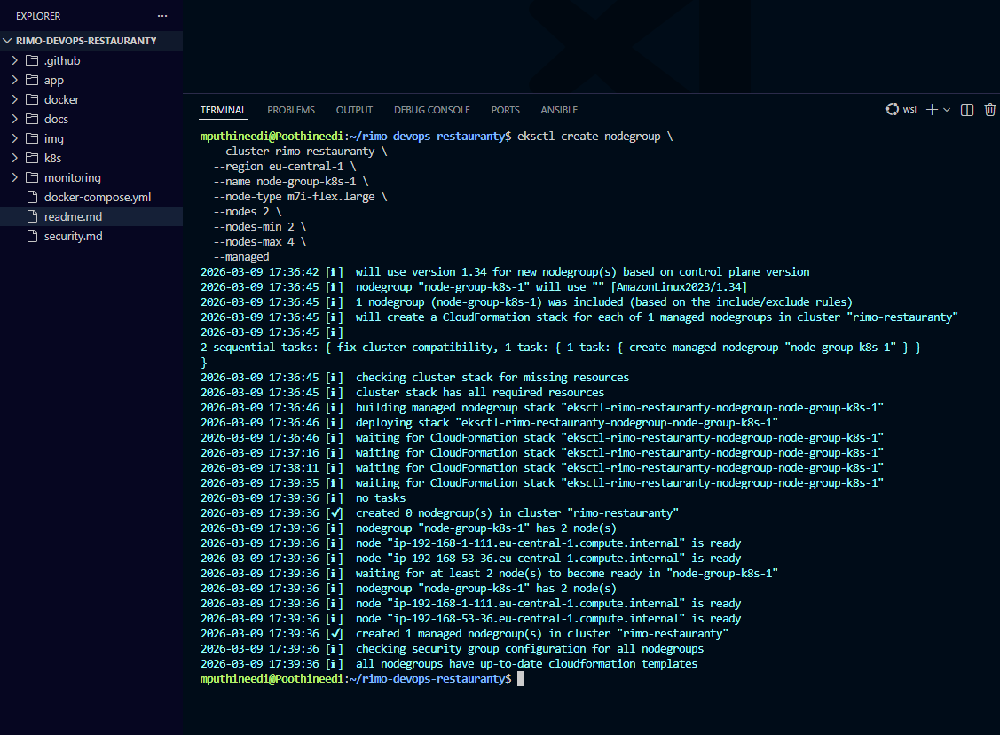
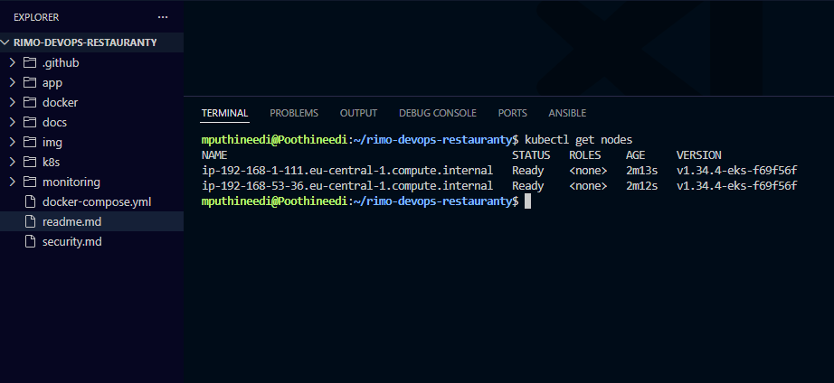
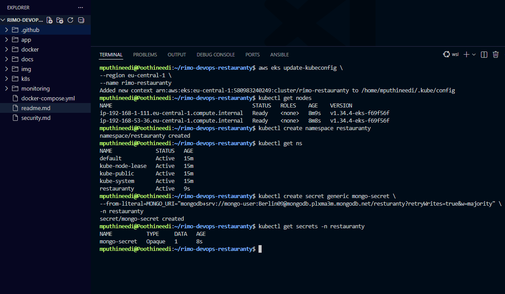
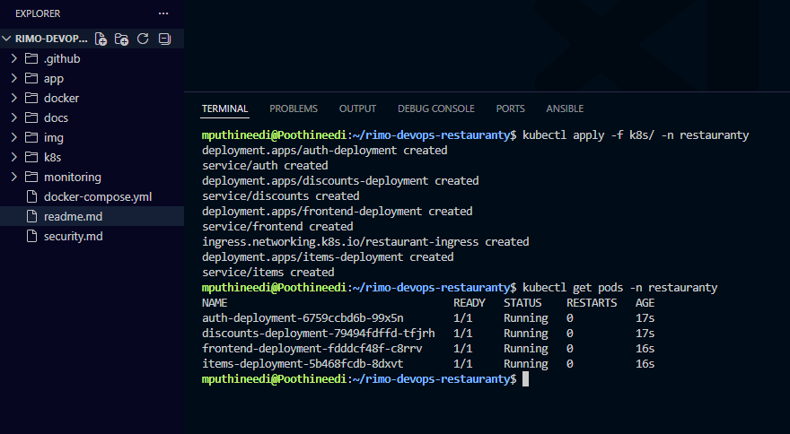
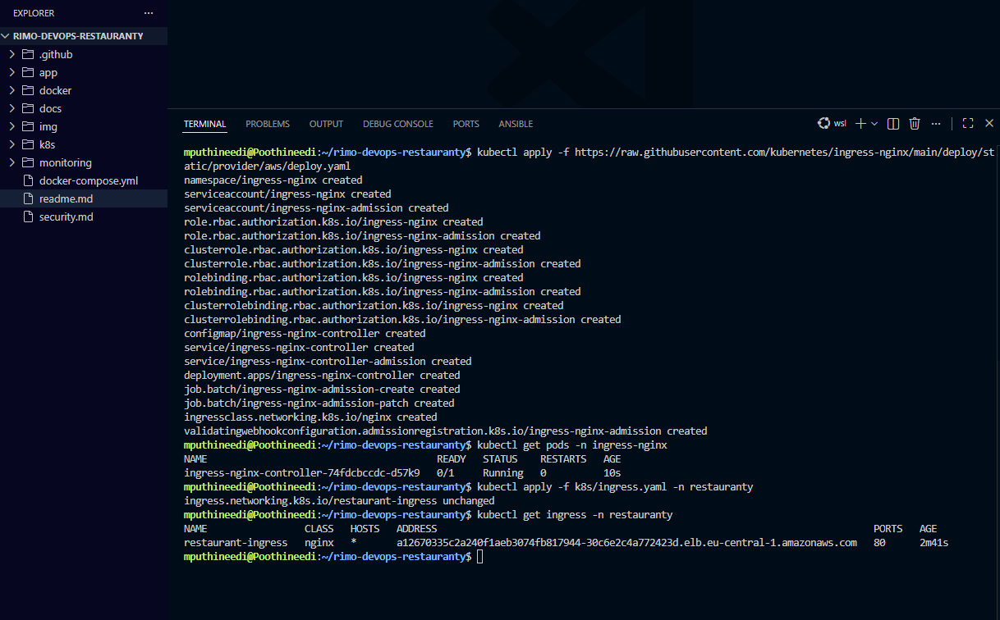
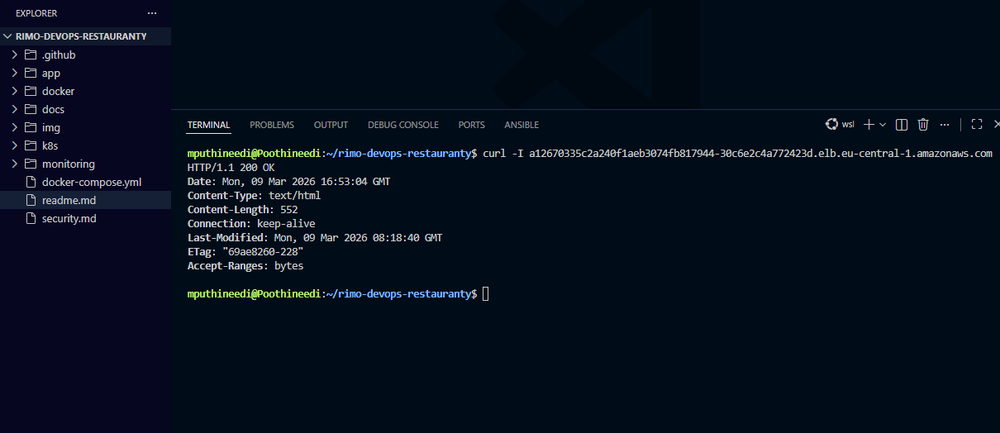

# Kubernetes Deployment Guide (AWS EKS)

This document explains how the Restauranty microservices application is deployed to AWS EKS using Kubernetes manifests. The deployment includes:

- Docker images pushed to Docker Hub
- AWS EKS cluster
- Managed node group
- Kubernetes deployments and services
- NGINX Ingress controller
- Public LoadBalancer endpoint

## 1. Login to Docker and Push Images

First authenticate with Docker Hub and push the container images so that Kubernetes can pull them during deployment.

```bash
docker login
```

```bash
docker tag rimo-devops-restauranty-auth rimo9docker/rimo-restauranty-auth:latest
docker tag rimo-devops-restauranty-discounts rimo9docker/rimo-restauranty-discounts:latest
docker tag rimo-devops-restauranty-items rimo9docker/rimo-restauranty-items:latest
docker tag rimo-devops-restauranty-client rimo9docker/rimo-restauranty-client:latest
```

```bash
docker push rimo9docker/rimo-restauranty-auth:latest
docker push rimo9docker/rimo-restauranty-discounts:latest
docker push rimo9docker/rimo-restauranty-items:latest
docker push rimo9docker/rimo-restauranty-client:latest
```

Images are now available in Docker Hub for Kubernetes deployments.




## 2. Create AWS EKS Cluster

Create the Kubernetes control plane using eksctl.

```bash
eksctl create cluster \
--name rimo-restauranty \
--region eu-central-1 \
--without-nodegroup \
--managed
```

This command:

- Creates an EKS control plane
- Configures networking
- Installs default Kubernetes addons



## 3. Create Node Group

Next, create worker nodes where the application containers will run.

```bash
eksctl create nodegroup \
--cluster rimo-restauranty \
--region eu-central-1 \
--name node-group-k8s-1 \
--node-type m7i-flex.large \
--nodes 2 \
--nodes-min 2 \
--nodes-max 4 \
--managed
```

This creates:

- Managed EC2 nodes
- Auto-scaling enabled worker nodes



## 4. Verify Nodes

Connect kubectl to the cluster and verify the nodes.

```bash
aws eks update-kubeconfig \
--region eu-central-1 \
--name rimo-restauranty
```

```bash
kubectl get nodes
```



## 5. Create Namespace

Create a dedicated namespace for the project.

```bash
kubectl create namespace restauranty
```

Verify namespaces:

```bash
kubectl get ns
```



## 6. Deploy Application Manifests

Apply Kubernetes deployment and service manifests.

```bash
kubectl apply -f k8s/ -n restauranty
```

This command deploys:

- Auth service
- discounts service
- items service
- frontend service
- ingress resource

Verify running pods:

```bash
kubectl get pods -n restauranty
```



## 7. Install NGINX Ingress Controller

Install the Kubernetes NGINX ingress controller.

```bash
kubectl apply -f https://raw.githubusercontent.com/kubernetes/ingress-nginx/main/deploy/static/provider/aws/deploy.yaml
```

Verify ingress controller:

```bash
kubectl get pods -n ingress-nginx
```

Then apply the ingress resource:

```bash
kubectl apply -f k8s/ingress.yaml -n restauranty
```

Retrieve ingress address:

```bash
kubectl get ingress -n restauranty
```



## 8. Test the Application

Once the ingress is deployed, Kubernetes provisions an AWS Elastic Load Balancer.

Test the application endpoint:

```bash
curl -I http://<ELB-ADDRESS>
```


