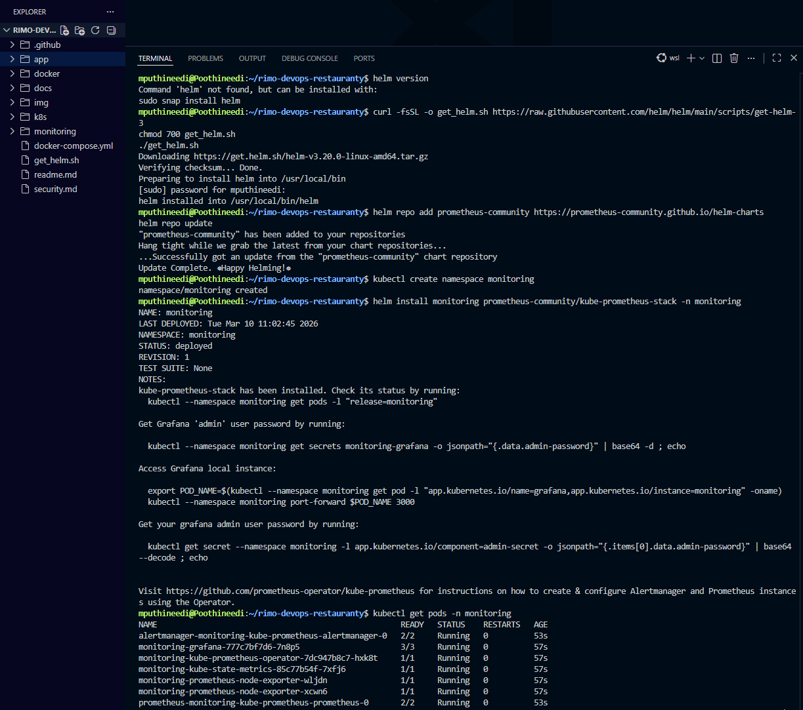
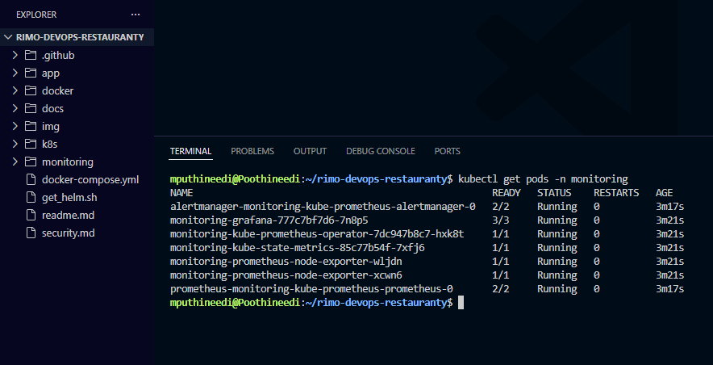
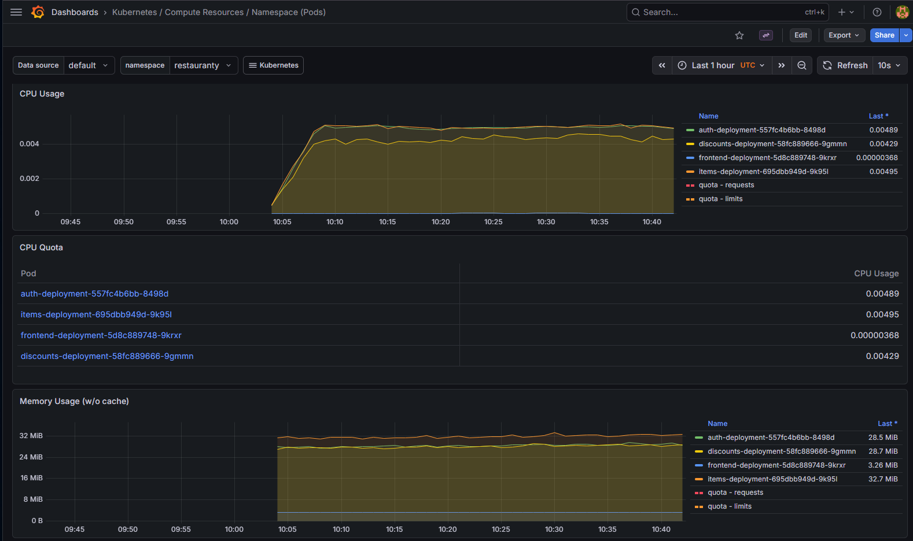
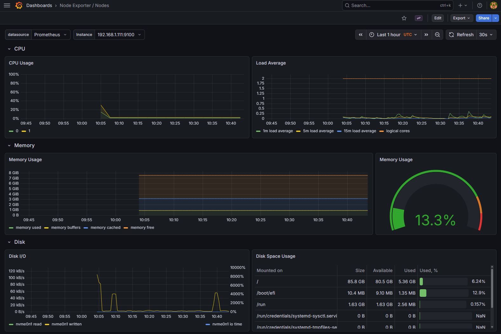

# Monitoring Setup (Prometheus + Grafana)

This section describes how to install Prometheus and Grafana in the Kubernetes cluster using Helm to monitor the Restauranty application and Kubernetes infrastructure.

---

## Step 1 – Verify Helm Installation

Helm is required to install the Prometheus and Grafana monitoring stack in Kubernetes. First verify that Helm is installed on your system.

```bash
helm version
```

If Helm is not installed, install it using the following commands:

```bash
curl -fsSL -o get_helm.sh https://raw.githubusercontent.com/helm/helm/main/scripts/get-helm-3
chmod 700 get_helm.sh
./get_helm.sh
```

---

## Step 2 – Add Prometheus Helm Repository

The Prometheus Community Helm repository contains the kube-prometheus-stack chart which installs Prometheus, Grafana, and other monitoring components together.

```bash
helm repo add prometheus-community https://prometheus-community.github.io/helm-charts
helm repo update
```

---

## Step 3 – Create Monitoring Namespace

Create a dedicated Kubernetes namespace to deploy monitoring tools separately from the application services.

```bash
kubectl create namespace monitoring
```

---

## Step 4 – Install Prometheus and Grafana Stack

Install the kube-prometheus-stack Helm chart which deploys Prometheus, Grafana, Alertmanager, node exporters, and other monitoring components.

```bash
helm install monitoring prometheus-community/kube-prometheus-stack -n monitoring
```

---

## Step 5 – Verify Monitoring Components

After installation, verify that all monitoring pods are running successfully inside the monitoring namespace.

```bash
kubectl get pods -n monitoring
```

Expected components include:

- Prometheus server
- Grafana
- Alertmanager
- Prometheus Operator
- Node Exporter
- Kube State Metrics

---

## Step 6 – Retrieve Grafana Admin Password

Grafana creates a Kubernetes secret that stores the admin login password. Retrieve the password using the following command.

```bash
kubectl get secret -n monitoring monitoring-grafana -o jsonpath="{.data.admin-password}" | base64 --decode && echo
```

Default Grafana username: admin

---

## Step 7 – Access Grafana Dashboard

Expose the Grafana service locally using port forwarding. This allows access to the Grafana dashboard from the browser.

```bash
kubectl port-forward -n monitoring svc/monitoring-grafana 3005:80
```

Open the Grafana dashboard in the browser:

```bash
http://localhost:3005
```

Login using:

Username: admin
Password: (value retrieved from Step 6)




---

## Result

After successful login, Grafana provides built-in dashboards for Kubernetes monitoring, including:

- Kubernetes Cluster metrics
- Node CPU and Memory usage
- Pod resource usage
- Namespace metrics

These dashboards visualize metrics collected by Prometheus from the EKS cluster and the Restauranty application pods.



